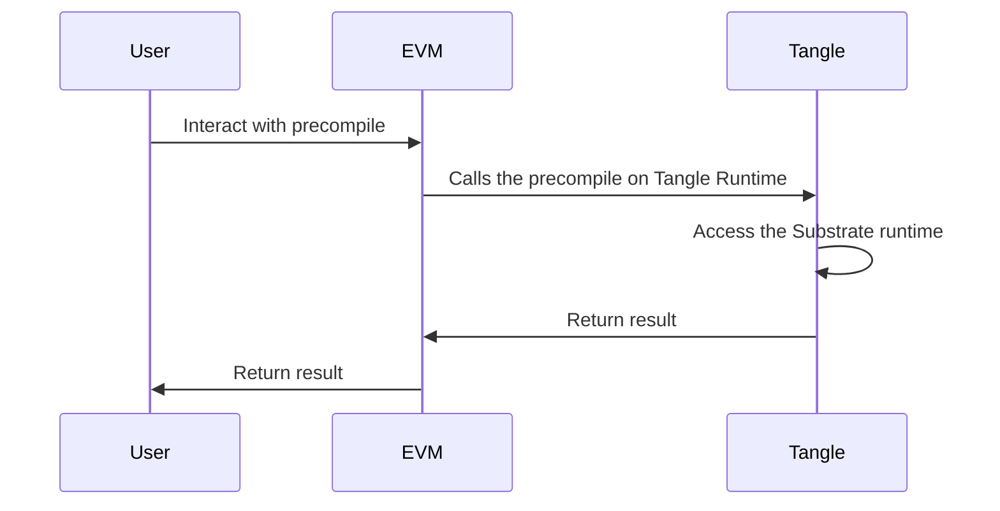

# Overview of the Precompiled Contracts on Tangle

## Overview

On Tangle Network, a precompiled contract is native Substrate code that has an Ethereum-style address and can be called using the Ethereum API, like any other smart contract. The precompiles allow you to call the Substrate runtime directly which is not normally accessible from the Ethereum side of Tangle.

The Substrate code responsible for implementing precompiles can be found in the EVM pallet. The EVM pallet includes the [standard precompiles found on Ethereum and some additional precompiles that are not specific to Ethereum](https://github.com/polkadot-evm/frontier/tree/master/frame/evm/precompile). It also provides the ability to create and execute custom precompiles through the generic [`Precompiles` trait](https://polkadot-evm.github.io/frontier/rustdocs/pallet_evm/trait.Precompile.html). There are several custom Tangle-specific precompiles that have been created.

The Ethereum precompiled contracts contain complex functionality that is computationally intensive, such as hashing and encryption. The custom precompiled contracts on Tangle provide access to Substrate-based functionality such as staking, governance, and more.

The Tangle-specific precompiles can be interacted with through familiar and easy-to-use Solidity interfaces using the Ethereum API, which are ultimately used to interact with the underlying Substrate interface. This flow is depicted in the following diagram:

## Precompiled Contract Addresses

The precompiled contracts are categorized by address and based on the origin network. If you were to convert the precompiled addresses to decimal format, and break them into categories by numeric value, the categories are as follows:

- **0-1023** - [Ethereum MainNet precompiles](#ethereum-precompiles)
- **1024-2047** - precompiles that are [not in Ethereum and not Tangle specific](#non-tangle-specific-nor-ethereum-precompiles)
- **2048-4095** - [Tangle specific precompiles](#tangle-specific-precompiles)

### Ethereum Precompiles

| Precompile             | Description                                                                                                       | Address                                      |
| ---------------------- | ----------------------------------------------------------------------------------------------------------------- | -------------------------------------------- |
| ECRECOVER              | Recovers the public key associated with the given signature, a critical operation in verifying wallet signatures. | `0x0000000000000000000000000000000000000001` |
| SHA256                 | Computes the SHA256 cryptographic hash function, widely used for data integrity verification.                     | `0x0000000000000000000000000000000000000002` |
| RIPEMD160              | Calculates the RIPEMD-160 hash, which is used in various security applications and protocols.                     | `0x0000000000000000000000000000000000000003` |
| Identity               | A simple data copy operation.                                                                                     | `0x0000000000000000000000000000000000000004` |
| Modular Exponentiation | Performs modular exponentiation, a key operation in many cryptographic functions.                                 | `0x0000000000000000000000000000000000000005` |
| BN128Add               | Performs point addition on a BN128 elliptic curve.                                                                | `0x0000000000000000000000000000000000000006` |
| BN128Mul               | Performs point multiplication on a BN128 elliptic curve.                                                          | `0x0000000000000000000000000000000000000007` |
| BN128Pairing           | Checks the pairing on a BN128 elliptic curve.                                                                     | `0x0000000000000000000000000000000000000008` |
| Blake2                 | Computes the Blake2 cryptographic hash function.                                                                  | `0x0000000000000000000000000000000000000009` |

### Non Tangle Specific Nor Ethereum Precompiles

| Precompile          | Description                                                       | Address                                      |
| ------------------- | ----------------------------------------------------------------- | -------------------------------------------- |
| SHA3FIPS256         | Computes the SHA3 (FIPS 202 compliant) hash function.             | `0x0000000000000000000000000000000000000400` |
| Dispatch            | Handles dispatching and managing contract calls and interactions. | `0x0000000000000000000000000000000000000401` |
| ECRecoverPublicKey  | Recovers the public key from an elliptic curve signature.         | `0x0000000000000000000000000000000000000402` |
| Curve25519Add       | Adds two Curve25519 points.                                       | `0x0000000000000000000000000000000000000403` |
| Curve25519ScalarMul | Multiplies a Curve25519 point by a scalar.                        | `0x0000000000000000000000000000000000000404` |
| Ed25519Verify       | Verifies an Ed25519 signature.                                    | `0x0000000000000000000000000000000000000405` |

### Tangle Specific Precompiles

| Precompile            | Description                                                                 | Address                                      |
| --------------------- | --------------------------------------------------------------------------- | -------------------------------------------- |
| Staking               | Handles staking-related operations.                                         | `0x0000000000000000000000000000000000000800` |
| Vesting               | Manages vesting schedules.                                                  | `0x0000000000000000000000000000000000000801` |
| Erc-20 Balances       | Treats TNT as a native ERC20 token on the EVM side of Tangle.               | `0x0000000000000000000000000000000000000802` |
| DemocracyInterface    | An interface for interacting with on-chain governance.                      | `0x0000000000000000000000000000000000000803` |
| Batch                 | Allows for multiple calls to be made within a single transaction.           | `0x0000000000000000000000000000000000000804` |
| Call Permit           | Facilitates authorized calls (for gasless transactions).                    | `0x0000000000000000000000000000000000000805` |
| Preimage              | Used for managing preimages, which are proposals before they become public. | `0x0000000000000000000000000000000000000806` |
| Precompile-Registry   | Manages the registration of new precompiles.                                | `0x0000000000000000000000000000000000000807` |
| Ecdsa-Secp256k1       | Verifies ECDSA signatures using the secp256k1 curve.                        | `0x0000000000000000000000000000000000000816` |
| Ecdsa-Secp256r1       | Verifies ECDSA signatures using the secp256r1 curve.                        | `0x0000000000000000000000000000000000000817` |
| Ecdsa-Stark           | Verifies ECDSA signatures using the Stark curve.                            | `0x0000000000000000000000000000000000000818` |
| Schnorr-Sr25519       | Verifies Schnorr signatures using the Sr25519 curve.                        | `0x0000000000000000000000000000000000000819` |
| Schnorr-Secp256k1     | Verifies Schnorr signatures using the secp256k1 curve.                      | `0x000000000000000000000000000000000000081a` |
| Schnorr-Ed25519       | Verifies Schnorr signatures using the Ed25519 curve.                        | `0x000000000000000000000000000000000000081b` |
| Schnorr-Ed448         | Verifies Schnorr signatures using the Ed448 curve.                          | `0x000000000000000000000000000000000000081c` |
| Schnorr-P256          | Verifies Schnorr signatures using the P256 curve.                           | `0x000000000000000000000000000000000000081d` |
| Schnorr-P384          | Verifies Schnorr signatures using the P384 curve.                           | `0x000000000000000000000000000000000000081e` |
| Schnorr-Ristretto255  | Verifies Schnorr signatures using the Ristretto255 curve.                   | `0x000000000000000000000000000000000000081f` |
| Schnorr-Taproot       | Verifies Schnorr signatures using the Taproot Scheme.                       | `0x0000000000000000000000000000000000000820` |
| Bls12-381             | Performs operations on the BLS12-381 curve.                                 | `0x0000000000000000000000000000000000000821` |
| MultiAsset Delegation | Provides functions for managing multi-asset delegation pallet.              | `0x0000000000000000000000000000000000000822` |
| Services Pallet       | Provides functions for managing services pallet.                            | `0x0000000000000000000000000000000000000823` |
| Liqued Staking        | Provides functions for managing liquid staking pallet.                      | `0x0000000000000000000000000000000000000824` |
